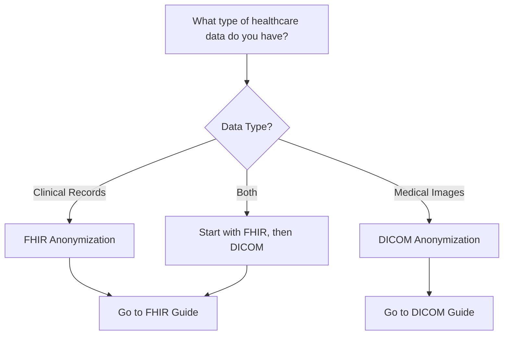

# Getting Started with Health Data Anonymization

Welcome! This project helps you anonymize two main types of healthcare data:

## 🏥 Choose Your Data Type

### **FHIR Data** (Clinical Records)
Fast Healthcare Interoperability Resources - JSON/XML formatted clinical data like patient records, lab results, medications, etc.

**Start here if you have:**
- Electronic Health Records (EHR) data
- Patient demographics, encounters, observations
- Data from modern healthcare APIs
- JSON or NDJSON files

📘 **[Get Started with FHIR Anonymization](./fhir-getting-started.md)**

---

### **DICOM Data** (Medical Imaging)
Digital Imaging and Communications in Medicine - Medical images like X-rays, CT scans, MRIs with embedded patient metadata.

**Start here if you have:**
- Medical imaging files (.dcm)
- Radiology or imaging study data
- PACS (Picture Archiving and Communication System) exports
- Images with patient information in metadata

📷 **[Get Started with DICOM Anonymization](./dicom-getting-started.md)**

---

## 🤔 Not Sure Which One?

| Question | FHIR | DICOM |
|----------|------|-------|
| Is your data primarily text/structured data? | ✅ | ❌ |
| Is your data primarily images? | ❌ | ✅ |
| Does your data come from an EHR system? | ✅ | ❌ |
| Does your data come from imaging equipment? | ❌ | ✅ |
| Is your data in JSON format? | ✅ | ❌ |
| Are your files .dcm or similar? | ❌ | ✅ |

## 📚 Learning Paths

### For FHIR Data:
1. [What is FHIR Anonymization?](./fhir-getting-started.md) - Understand the basics
2. [FHIR Quick Start](./fhir-quick-start.md) - 5-minute tutorial
3. [FHIR Use Cases](./fhir-use-cases.md) - Real-world examples

### For DICOM Data:
1. [What is DICOM Anonymization?](./dicom-getting-started.md) - Understand the basics
2. [DICOM Quick Start](./dicom-quick-start.md) - Anonymize your first image
3. [DICOM Use Cases](./dicom-use-cases.md) - Common scenarios

## 🎯 Common Scenarios

**Research Dataset Preparation**
- Both FHIR and DICOM data often need anonymization for research
- May need to coordinate anonymization across both types

**Development and Testing**
- Create realistic test data without privacy concerns
- Maintain relationships between clinical data and images

**Compliance (HIPAA, GDPR)**
- Both data types contain protected health information
- Similar principles, different technical approaches

## 🚀 Quick Decision Guide

---

💡 **Note**: This is a first draft of the getting-started guide. We'll be adding more examples, tutorials, and use cases based on community feedback!
